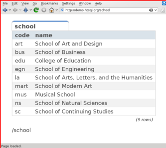

*******************
  HTSQL Showcase
*******************

What is HTSQL?
==============

HTSQL supports parsimonious database reporting and self-documenting
dashboards.  By reducing query construction complexity, HTSQL enables
a new level of service for your existing databases.

HTSQL is a Web Query Language
-----------------------------

.. sourcecode:: htsql

   /school

HTSQL is a REST query language for the web.  Queries *are* URLs_ that
can be directly typed into a browser.  The default output format of the
request depends upon the user-agent and its Accept_ header.

.. _Accept: http://www.w3.org/Protocols/rfc2616/rfc2616-sec14.html
.. _URLs: http://www.ietf.org/rfc/rfc3986.txt

HTSQL is a Relational Database Gateway
--------------------------------------

.. container:: vsplit

   .. sourcecode:: htsql

      /school

   .. sourcecode:: sql

      SELECT code, name
      FROM ad.school
      ORDER BY code;

HTSQL provides access to relational databases via web service.  It
translates a URL into corresponding SQL, executes this query against the
database, and returns the result as formatted as requested by the user
agent.  For example, this example query (A1_) returns all rows and all
columns for the ``school`` table formatted for the given user agent.

.. _A1: http://demo.htsql.org/school

HTSQL Makes Dashboarding Easy
-----------------------------

.. image:: img/htraf_screenshot.png
   :alt: The HTRAF demo
   :align: right
   :target: http://htraf.htsql.org/

.. sourcecode:: html

    <body>
        <h3>Select School</h3>
        <select id="school"
                data-source="/school{code, name}"/>
        
0" 
             data-display="chart"
             data-chart-title="Percent of Students by Program"/>

        <h3>Departments</h3>
        
Filter by name: <input id="department_name"/>

        <table id="department"
               data-hide-first-column="yes" 
               data-source="/department{code, name, school.name}
                            ?school=$school&name~$department_name"/>
        

            The selected department: 
            <em data-source="/department{name}?code=$department"/>
             
            The number of courses in selected department:
            <strong data-source="/department{count(course)}
                                 ?code=$department"/>
        

        <h3>Courses</h3>
        <table id="course" 
               data-source="/course?department=$department"/>
    </body>

The dashboard above (using the JQuery HTRAF toolkit) shows a 3-level
drill down (``school``, ``department`` and ``course``) for a university
schema.  The live demo for this dashboard is at http://htraf.htsql.org/. 

Basic Queries
=============

For the examples below, the following "university catalog" schema is
used.  It has two top-level tables, ``school`` and ``department``; where
department has an optional link to school.  Subordinate tables, having
mandatory foreign key references are ``course`` and ``program``::

         +-------------+       +--------+
    /---m| DEPARTMENT  |>-----o| SCHOOL |m----\
    |.   +-------------+  .    +--------+    .|
    | .                  .                  . |
    |   department   department    a school   |
    |   offers       may be part   has one or |
    |   courses      of school     programs   |
    |                                         |
    |    +-------------+       +---------+    |
    \---<| COURSE      |       | PROGRAM |>---/
         +-------------+       +---------+

List all schools
----------------

An **HTSQL** query (A1_)::

    /school

An equivalent **SQL** query::

    SELECT code, name
    FROM ad.school
    ORDER BY code;

.. _A1: http://demo.htsql.org/school

Programs ordered by the title
-----------------------------

**HTSQL** (A2_)::

    /program{title+}

**SQL**::

    SELECT title
    FROM ad.program
    ORDER BY title, school, code;

.. _A2: http://demo.htsql.org/program{title+}

All courses missing a description
---------------------------------

**HTSQL** (A3_)::

    /course?!description

**SQL**::

    SELECT department, number, title, credits, description
    FROM ad.course
    WHERE NULLIF(description, '') IS NULL
    ORDER BY 1, 2;

.. _A3: http://demo.htsql.org/course?!description

Departments in schools having "art" in its name
-----------------------------------------------

**HTSQL** (A4_)::

    /department?school.name~'art'

**SQL**::

    SELECT d.code, d.name, d.school
    FROM ad.department AS d
    LEFT OUTER JOIN
         ad.school AS s ON (d.school = s.code)
    WHERE s.name ILIKE '%art%'
    ORDER BY 1;

.. _A4: http://demo.htsql.org/department?school.name~'art'

The number of schools
---------------------

**HTSQL** (A5_)::

    /count(school)

**SQL**::

    SELECT COUNT(TRUE)
    FROM ad.school;

.. _A5: http://demo.htsql.org/count(school)

Schools with programs
---------------------

**HTSQL** (A6_)::

    /school?exists(program)

**SQL**::

    SELECT s.code, s.name
    FROM ad.school AS s
    WHERE EXISTS(SELECT TRUE
                 FROM ad.program AS p
                 WHERE s.code = p.school)
    ORDER BY 1;

.. _A6: http://demo.htsql.org/school?exists(program)

Advanced Queries
================

The number of schools with programs
-----------------------------------

**HTSQL** (B1_)::

    /count(school?exists(program))

**SQL**::

    SELECT COUNT(TRUE)
    FROM ad.school AS s
    WHERE EXISTS(SELECT TRUE
                 FROM ad.program AS p
                 WHERE (s.code = p.school));

.. _B1: http://demo.htsql.org/count(school?exists(program))

Number of programs and departments per school
---------------------------------------------

**HTSQL** (B2_)::

    /school{name, count(program), count(department)}

**SQL**::

    SELECT s.name, COALESCE(p.cnt, 0), COALESCE(d.cnt, 0)
    FROM ad.school AS s
    LEFT OUTER JOIN
         (SELECT COUNT(TRUE) AS cnt, p.school
          FROM ad.program AS p
          GROUP BY 2) AS p ON (s.code = p.school)
    LEFT OUTER JOIN
         (SELECT COUNT(TRUE) AS cnt, d.school
          FROM ad.department AS d
          GROUP BY 2) AS d ON (s.code = d.school)
    ORDER BY s.code;

.. _B2: http://demo.htsql.org/school{name,count(program),count(department)}

Average number of courses offered by departments in each school
---------------------------------------------------------------

**HTSQL** (B3_)::

    /school{name, avg(department.count(course))}

**SQL**::

    SELECT s.name, d.av
    FROM ad.school AS s
    LEFT OUTER JOIN
         (SELECT AVG(CAST(COALESCE(c.cnt, 0) AS NUMERIC)) AS av, d.school
          FROM ad.department AS d
          LEFT OUTER JOIN
               (SELECT COUNT(TRUE) AS cnt, c.department
               FROM ad.course AS c
               GROUP BY 2) AS c ON (d.code = c.department)
          GROUP BY 2) AS d ON (s.code = d.school)
    ORDER BY s.code;

.. _B3: http://demo.htsql.org/school{name,avg(department.count(course))}

.. warning::

   The following examples do not work in 2.0; will be available in 2.1+.

*Programs and departments in each school*
-----------------------------------------

**HTSQL** (C1_, using 1.0, different syntax)::

    /school{name, /program{title}, /department{name}}

This query produces a *tree* output::

    [
     ["School of Art and Design",
      ["Post Baccalaureate in Art History", ...],
      ["Art History", "Studio Art"]],
     ["School of Business",
      ["Graduate Certificate in Accounting", ...],
      ["Accounting", "Capital Markets", "Corporate Finance"]],
     ...
    ]

You need at least 3 **SQL** statements to produce the same result::

    SELECT name, code
    FROM ad.school
    ORDER BY code;

    SELECT s.code, p.title
    FROM ad.school AS s
    INNER JOIN
         ad.program AS p ON (s.code = p.school)
    ORDER BY s.code, p.code;

    SELECT s.code, d.name
    FROM ad.school AS s
    INNER JOIN
         ad.department AS d ON (s.code = d.school)
    ORDER BY s.code, d.code;

.. _C1: http://demo.htsql.com/school{name}/(program{title};department{name})

*The number of programs per degree*
-----------------------------------

**HTSQL** (C2_, using 1.0)::

    /program{degree^, count()}

**SQL**::

    SELECT degree, COUNT(TRUE)
    FROM ad.program
    GROUP BY 1
    ORDER BY 1;

.. _C2: http://demo.htsql.com/program{degree^,count()}

*The number&list of schools and the top 2 departments by the number of programs*
--------------------------------------------------------------------------------

**HTSQL** (C3_, using 1.0, different syntax, w/o ``top()``)::

    /school{count(program)^, count(), /name, /department.top(2)}

**SQL**: *Ahhh!*

.. _C3: http://demo.htsql.com/school{count(program)^,count()}/({name};department)

For more examples, see `feature_tests`_, `function_tests`_ and read
:doc:`tutorial`.

.. _feature_tests:
    http://bitbucket.org/prometheus/htsql/src/tip/test/input/schema.yaml

.. _function_tests:
    http://bitbucket.org/prometheus/htsql/src/tip/test/input/library.yaml

